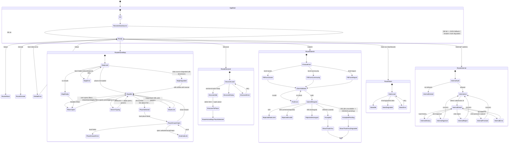

```mermaid
stateDiagram-v2
  [*] --> AppBoot

  state AppBoot {
    [*] --> Init
    Init --> ResolveDataSource
    ResolveDataSource --> Ready : DB ok
    ResolveDataSource --> Ready : DB fail -> JSON fallback / headers mark degraded
  }

  Ready --> RouteHomeMap : /
  Ready --> RouteDiscover : /discover
  Ready --> RouteSubmit : /submit
  Ready --> RouteStats : /stats (or /dashboard)
  Ready --> RouteAbout : /about
  Ready --> RouteDonate : /donate
  Ready --> RouteInternal : /internal/* (admin)

  %% ---- Global errors ----
  Ready --> GlobalError : fatal client error
  GlobalError --> Ready : reload

  %% =========================
  %% Home/Map route
  %% =========================
  state RouteHomeMap {
    [*] --> MapLoad
    MapLoad --> MapIdle : places list loaded
    MapLoad --> MapEmpty : no results
    MapLoad --> MapDegraded : data source degraded (db down/json)
    MapLoad --> MapError : fetch failed (network/parse)

    MapIdle --> FiltersOpen : user opens filters drawer/panel
    FiltersOpen --> MapIdle : apply filters (query params)
    MapIdle --> SearchTyping : typing search
    SearchTyping --> MapIdle : debounce -> apply query params

    MapIdle --> PlaceSelected : click pin/list row OR deep link /place?id=...
    PlaceSelected --> PlaceDrawerOpen : load place detail
    PlaceDrawerOpen --> PlaceDrawerError : load failed
    PlaceDrawerOpen --> MapIdle : close drawer

    PlaceDrawerOpen --> ExternalLink : open website/social/maps
    ExternalLink --> PlaceDrawerOpen : back

    MapIdle --> ShareLink : copy/share URL with params
    ShareLink --> MapIdle

    MapError --> MapLoad : retry
    MapEmpty --> FiltersOpen : broaden filters
    MapDegraded --> MapIdle : still usable with banner
  }

  %% =========================
  %% Discover route (browse-first)
  %% =========================
  state RouteDiscover {
    [*] --> DiscoverLoad
    DiscoverLoad --> DiscoverIdle : sections/cards ready
    DiscoverLoad --> DiscoverEmpty
    DiscoverLoad --> DiscoverError
    DiscoverIdle --> DiscoverToPlace : select item -> open place
    DiscoverToPlace --> RouteHomeMap.PlaceSelected
    DiscoverError --> DiscoverLoad : retry
  }

  %% =========================
  %% Submit route (owner/community/report)
  %% =========================
  state RouteSubmit {
    [*] --> ChooseKind
    ChooseKind --> FillFormOwner : kind=owner
    ChooseKind --> FillFormCommunity : kind=community
    ChooseKind --> FillFormReport : kind=report

    %% shared validation
    FillFormOwner --> ClientValidate
    FillFormCommunity --> ClientValidate
    FillFormReport --> ClientValidate

    ClientValidate --> FixErrors : invalid
    FixErrors --> ClientValidate : re-check
    ClientValidate --> SubmitRequest : valid

    %% server accept/reject
    SubmitRequest --> RejectedRateLimit : 429
    SubmitRequest --> RejectedInvalid : 400 (schema/required)
    SubmitRequest --> RejectedHoneypot : 400 (honeypot)
    SubmitRequest --> Accepted : 200/201 (saved)
    SubmitRequest --> AcceptedPending : 202 (db unavailable -> NDJSON pending)

    Accepted --> ShowThankYou
    AcceptedPending --> ShowThankYouDegraded

    ShowThankYou --> [*]
    ShowThankYouDegraded --> [*]
  }

  %% =========================
  %% Internal review route
  %% =========================
  state RouteInternal {
    [*] --> InternalAuth
    InternalAuth --> InternalDenied : not allowed
    InternalAuth --> InternalList : allowed

    InternalList --> InternalDetail : select submission id
    InternalDetail --> InternalHistory : load history
    InternalHistory --> InternalDetail

    InternalDetail --> InternalApprove : click approve
    InternalDetail --> InternalReject : click reject
    InternalDetail --> InternalPromote : click promote->places

    InternalApprove --> InternalList : success
    InternalReject --> InternalList : success
    InternalPromote --> InternalList : success

    InternalDetail --> InternalError : api failed
    InternalError --> InternalDetail : retry
  }

  %% =========================
  %% Stats route
  %% =========================
  state RouteStats {
    [*] --> StatsLoad
    StatsLoad --> StatsIdle
    StatsLoad --> StatsDegraded : missing/partial data
    StatsLoad --> StatsError
    StatsError --> StatsLoad : retry
  }
```
